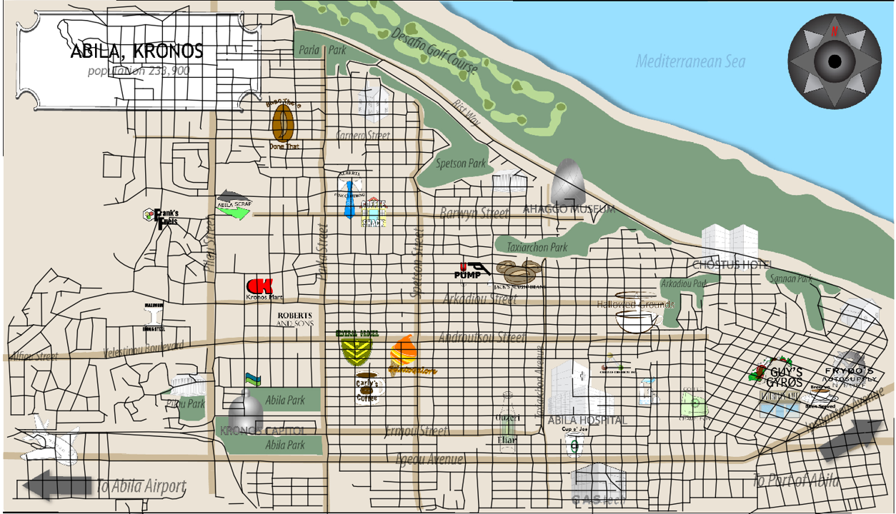

```{r setup, include=FALSE}
options(htmltools.dir.version = FALSE)
knitr::opts_chunk$set(echo = TRUE,
                      eval = TRUE,
                      fig.retina = 3,
                      message = FALSE,
                      warning = FALSE)
```

# Data Preparation for Question 4.2

```{r}
packages = c('DT','ggiraph','plotly','tidyverse', 'raster','sf','clock','tmap',
             'rgdal','dplyr', 'tidyr', 'textclean', "plotly", "forcats", "jpeg", "tiff",
             "mapview","tidygraph","igraph","ggraph","visNetwork","lubridate")
for(p in packages){
  if(!require(p,character.only = T)){
    install.packages(p)
  }
  library(p,character.only = T)
}
```

```{r}
car <- read_csv("data/mc2/car-assignments.csv")
cc <- read_csv("data/mc2/cc_data.csv", locale = locale(encoding = "ASCII"))
gps <- read_csv("data/mc2/gps.csv")
loyalty <- read_csv("data/mc2/loyalty_data.csv",locale = locale(encoding = "ASCII"))
```

```{r}
cc$last4ccnum <- as.factor(cc$last4ccnum)
loyalty$loyaltynum <- as.factor(loyalty$loyaltynum)
```

```{r}
cc$timestamp <- date_time_parse(cc$timestamp,
                                 zone = "",
                                 format = "%m/%d/%Y %H:%M")

loyalty$timestamp <- date_parse(loyalty$timestamp,
                                 format = "%m/%d/%Y")

```

```{r}
cc_dtsplit <- cc %>%
  mutate(day = date_weekday_factor(cc$timestamp), date =  as_date(cc$timestamp), time = format(cc$timestamp, format = "%H:%M"))

cc_dtsplit

```

```{r}
loyalty_dt <- rename(loyalty, date = timestamp)

```

```{r}
car$CarID = as.factor(car$CarID)
gps$id = as.factor(gps$id)

```

```{r}
car_unite <- car %>%
  unite(col = "name", LastName,FirstName, sep = ", ",  remove =FALSE) 

```

```{r}
gps_cleaned <- rename(gps,CarID = id)

gps_cleaned$Timestamp <- date_time_parse(gps_cleaned$Timestamp,
                                 zone = "",
                                 format = "%m/%d/%Y %H:%M")

```

```{r}
cc_dtsplit_bar <- cc_dtsplit %>%
  count(location) %>%
  mutate(location = fct_reorder(location, n, .desc =TRUE)) %>%
  plot_ly(x = ~location, y = ~n, marker = list(color = ~n)) %>%
  add_bars() %>%
  layout(title = "Total number of visitation by location", xaxis = list(title = ""),yaxis = list(title = "Number of visitors"))

cc_dtsplit_bar
```

```{r}
loyalty_dt_bar <- loyalty_dt %>%
  count(location) %>%
  mutate(location = fct_reorder(location, n, .desc =TRUE)) %>%
  plot_ly(x = ~location, y = ~n, marker = list(color = ~n)) %>%
  add_bars() %>%
  layout(title = "Total number of visitation by ", xaxis = list(title = ""),yaxis = list(title = "Number of visitors"))

loyalty_dt_bar
```

```{r}
cc_loyalty_join <- cc_dtsplit %>%
  inner_join(loyalty_dt, by = c("date","location", "price"))

cc_loyalty_join
```


### 4.3. Can you infer the owners of each credit card and loyalty card? What is your evidence? Where are there uncertainties in your method? Where are there uncertainties in the data? Please limit your answer to 8 images and 500 words.

To infer the cc and loyalty card data to the CarID, we will need to use the movement data using the geospatial data that was provided. We will first take a look at the tourist map in jpg form. Notice that there are some locations that were provided in the cc and loyalty dataset but not detectable in the tourist map. As such, there are some discrepancies in the map given. 


Next, the jpg file provided does not have any movement data projected into it. As such, we will need to use an additional software to import the movement data into the map. The software to allow us to import the movement data into the map is QGIS georeferencing software. The end product is as shown below.




Next, we will read the Tag Image File (TIF) that we have created into RStudio via the function raster. Raster is a package to read, write and manipulate spatial data into R.
 

```{r}
map <- raster("data/MC2/MC2-tourist_modified.tif")

map


```

Next, we will output the raster layer using tm_shape. 


```{r}
tm_shape(map) +
tm_rgb(map, r = 1,g = 2,b = 3,
alpha = NA,
saturation = 1,
interpolate = TRUE,
max.value = 255)

```

Next, we will import the GIS data layer in the ESRI shapefile format.


```{r}
Abila_st <- st_read(dsn = "data/MC2/Geospatial",
layer = "Abila")


```

Next, we will create a day factor, e.g. 2014-01-06 will be day 6. This will us to filter the day more easily when we analyse the car movement later. 


```{r}
gps_cleaned$day <- as.factor(get_day(gps_cleaned$Timestamp))

gps_cleaned

```

Converting aspatial data into simple feature data frame.


```{r}
gps_sf <- st_as_sf(gps_cleaned,
  coords = c("long", "lat"),
  crs= 4326)

gps_sf
```


Creation of movement path


```{r}
gps_path <- gps_sf %>%
group_by(CarID, day) %>%
summarize(m_Timestamp = mean(Timestamp),
do_union=FALSE) %>%
st_cast("LINESTRING")

gps_path
```

Before we plot the GPS path, we will need to remove the orphan lines which are represented by p = 1. 


```{r}
    p = npts(gps_path, by_feature = TRUE)
    gps_path2 <- cbind(gps_path, p)
                
    gps_path_revised <- gps_path2 %>%
      filter(p != 1)
    
    gps_path_revised

```


With the above prepared data. We are now ready to plot the GPS path into the map. First, we will filter the data by day == 10. To sieve out all those vehicle movements in day 10. 

Next, we will tmap to produce the map, afterwhich the tm_shape and tm_lines are use to plot the movement lines onto the map. Lastly, we will create some layout such as label and legend to differentiate the CarID. The geospatial map produced is interactive whereby user are able to hover their mouse to a line in which a tooltip of the CarID will show up.

Note that currently, there is no interative button or dropdown list for user to select the day or CarID they wanted. A shiny app will be required to perform this role. However, the shinyapp will not be shown this assignment.


```{r}
gps_path_selected <- gps_path_revised %>%
filter(day == 10)
gps_path_selected


tmap_mode("view")
tm_shape(map) +
tm_rgb(map, r = 1,g = 2,b = 3,
alpha = NA,
saturation = 1,
interpolate = TRUE,
max.value = 255) +
tm_shape(gps_path_selected) +
tm_lines(col = "CarID",palette="-RdYlBu") +
  tm_text(text = "CarID") +
  tm_layout (title = "Map of car movements") 


```


