```{r setup, include=FALSE}
options(htmltools.dir.version = FALSE)
knitr::opts_chunk$set(echo = TRUE,
                      eval = TRUE,
                      fig.retina = 3,
                      message = FALSE,
                      warning = FALSE)
```

# 4.5. Do you see evidence of suspicious activity? Identify 1- 10 locations where you believe the suspicious activity is occurring, and why Please limit your response to 10 images and 500 words.

### 4.5.1 Day 11, CarID 26 visited a house at Canero street.

Most of the days, only CarIDs 2, 3 & 11 will be visit this house which presumably is their residence. However on day 11, CarID 26 went to the house. 

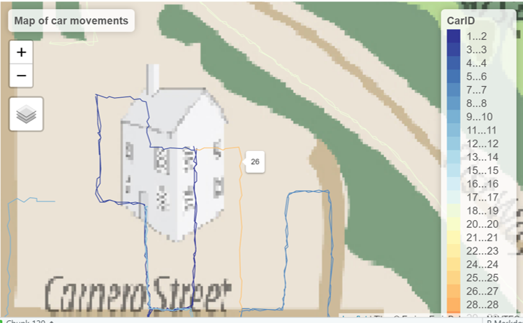

Based on the network analysis, CarID 26 has no close relationship with CarIDs 2,3 & 11. So it is suspicious on why this employee went there.

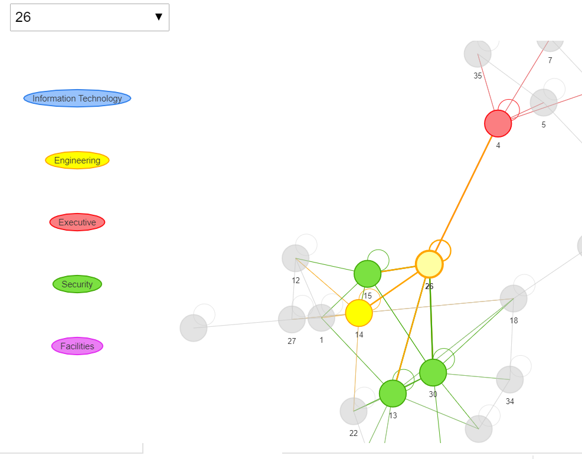


### 4.5.2. Most days. Unidentified place.

On most days, 101, 106 & 107 will meetup at an unidentified location opposite brews been served. 

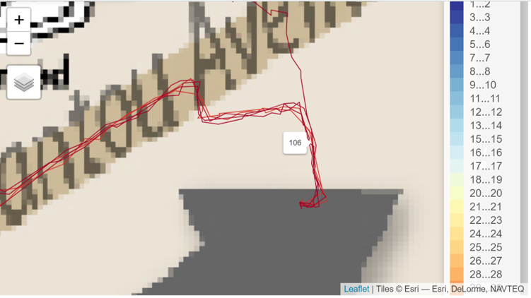


### 4.5.3. Day 10, Unidentified place

On day 10, CarID 24 stops at an identified place between Frank Fuel, Abila Scrap and Kronos Mart.

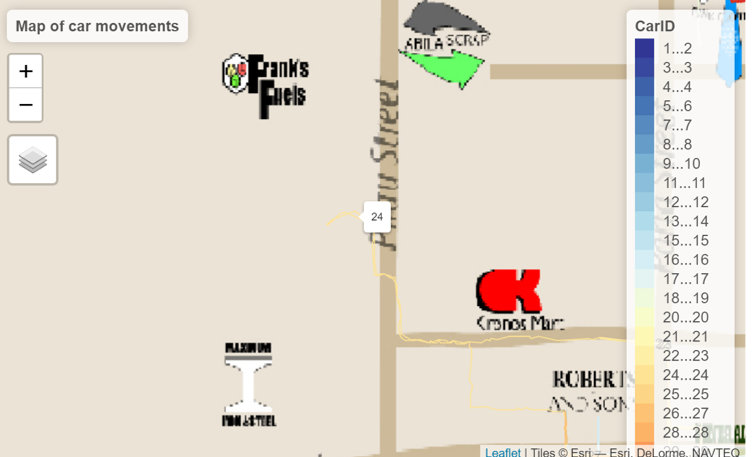

### 4.5.4. Day 10, House at Carnero Street.

On day 10, 1,2,5,6,7,8,9,11,14,18,19,25,26,33 visited or pass by the house which is normally frequented by 2,3 & 11.

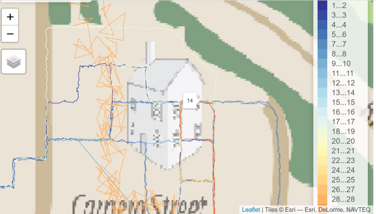

### 4.5.5. Day 13 & 14. House at Barwyn Street

Normally this house is frquented by 4 & 35. However on day 13 & 14, CarID 21 went to or pass by the house.

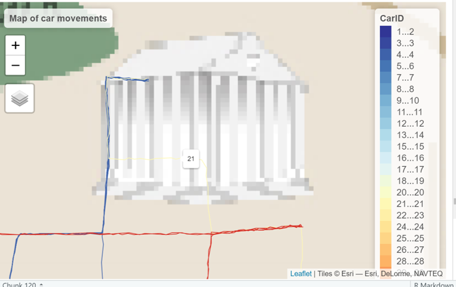

### 4.5.6. Most days. Frydo's Autosupply n More. 

On most days, CarID 13, 15, 16 & 21 will pass by Frydo's Autosupply n More. However, only CarID 13 have business there. 

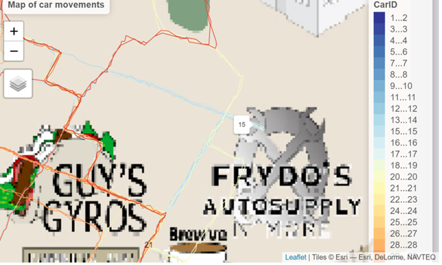

Analysing the network analysis, we can see that all of them do not have close relationship with one another.

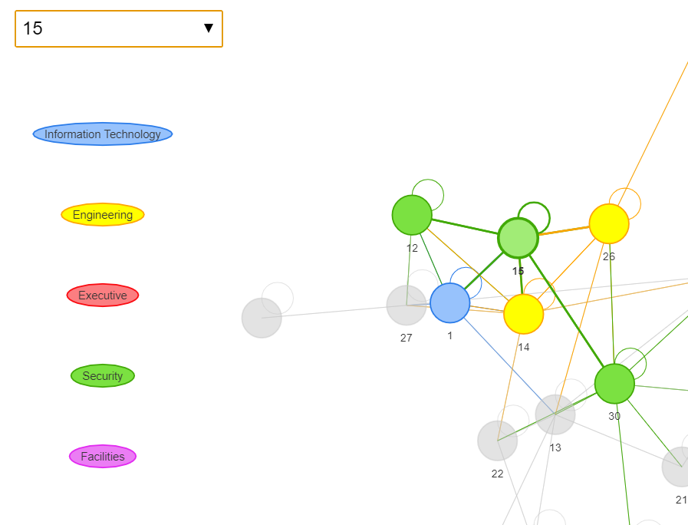

### 4.5.7. Day 18. Kronos Mart

On Day 18, CarID 5 stop at Kronos Mart but did not purchase anything.

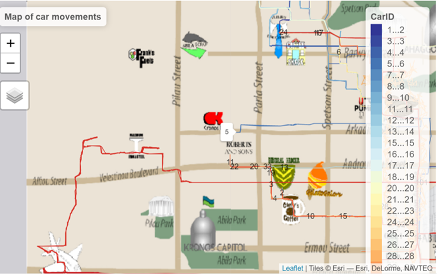

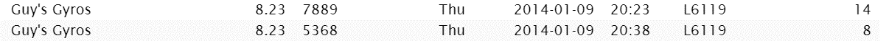

### 4.5.8. Day 17. Chostus Hotel.

Three CarIDs (7,31,33) visited Chostus Hotel. However, only one (33) book the hotel. 

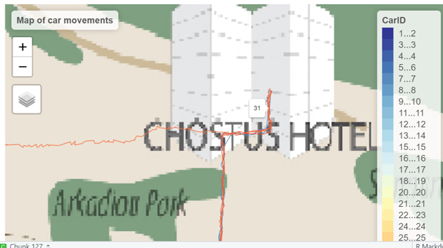

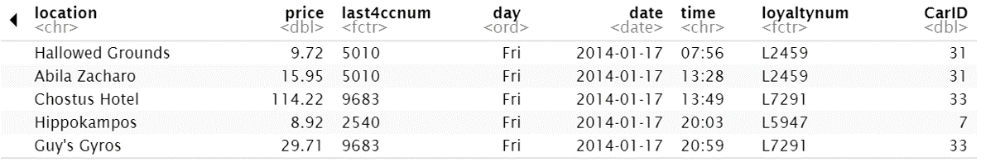

All three do not have any indication of close relationship.

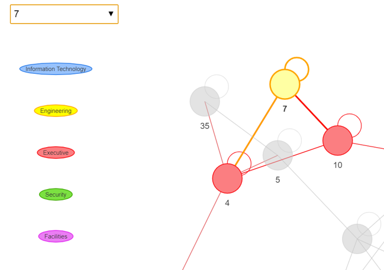


### 4.5.9. Day 8, Near Max Iron and Steel.

Truck 107 stop at an unidentified area near Max Iron and Steel.

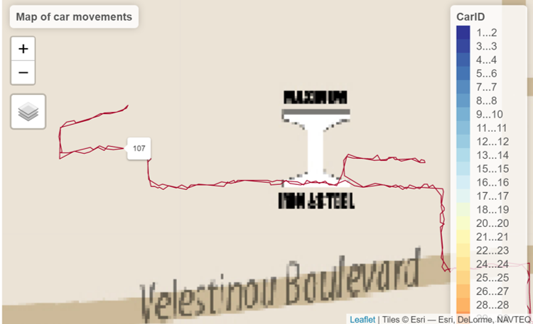

### 4.5.10. Day 16. Near Kronos Mart.

Car 21 and 24 stop in between Frank Fuel, Abila Scrap and Kronos Mart to meet.

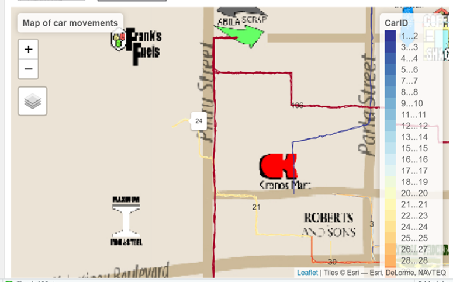
There is no indication that both cars have close relationship.

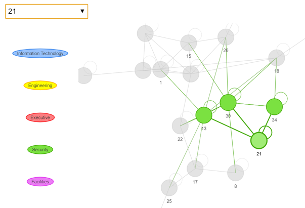


